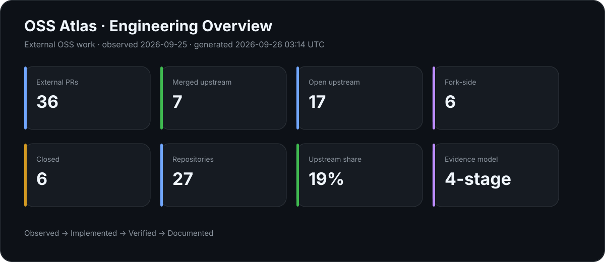
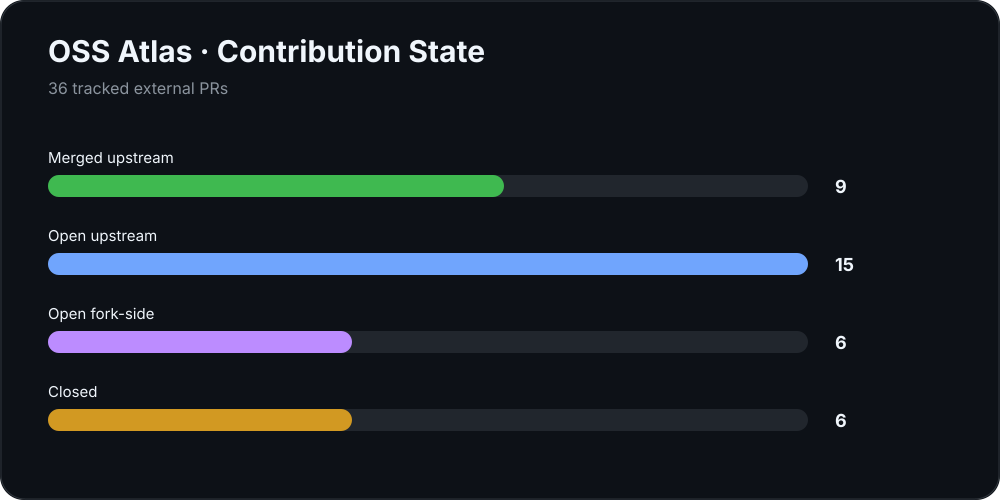
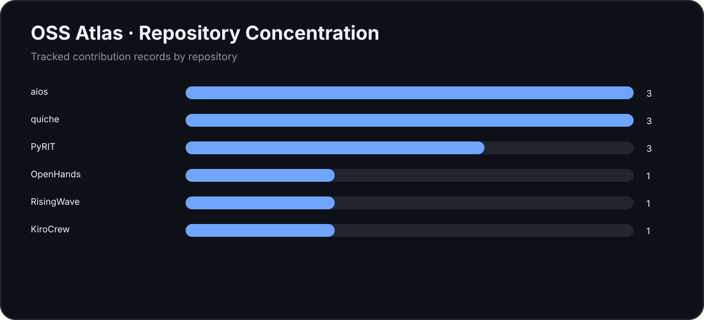
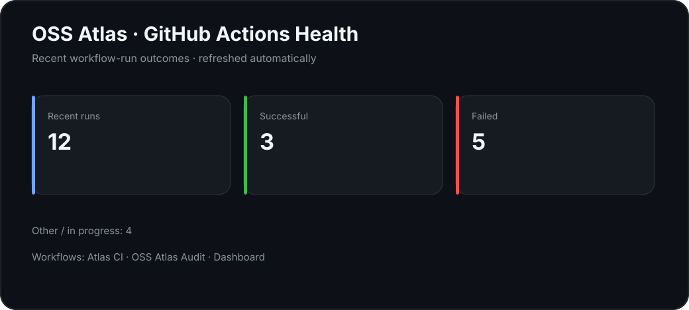

# 🏆 Featured Upstream Contributions — Microsoft PyRIT

> ## **Two PRs — Both MERGED UPSTREAM**
>
> **#2762 — Dataset Summary API** · September 24, 2026 · merge commit `47c6151a`
>
> **#2823 — HarmBench context preservation** · September 25, 2026 · merge commit `940a8efabb404d80f6a716c5e641d81809d8972a`
>
> Together, these are two separate accepted upstream contributions to Microsoft's open-source AI red-teaming framework, spanning backend feature work and regression-focused behavior preservation.
---

<p align="center">

</p>

<p align="center">


</p>

# OSS Atlas

**OSS Atlas** is the dedicated open-source engineering ledger for my external OSS work.

It records contributions, upstream outcomes, maintainer feedback, technical investigations, discussions, case studies, and durable engineering lessons — while deliberately excluding self-repository portfolio work.

> **Observed → Implemented → Verified → Documented**

## 🧭 Start here

| Surface | Purpose |
|---|---|
| [Contributions Index](contributions/INDEX.md) | Curated map of OSS work |
| [Complete OSS PR History](contributions/ALL_PR_HISTORY.md) | External OSS PR archive |
| [Machine-readable index](data/contributions.json) | Canonical contribution metadata |
| [Evidence-derived skills](data/skills.json) | Skills mapped to contribution evidence |
| [Case Studies](case-studies/README.md) | Deep evidence-backed analysis |
| [Research](research/README.md) | Reviews, investigations, discussions |
| [Learnings](learnings/README.md) | Reusable engineering lessons |
| [2026-09-25 Ledger](contributions/ALL_PR_HISTORY.md) | Dated contribution-state snapshot |
| [Operating Model](docs/OPERATING_MODEL.md) | Evidence and maintenance rules |
| [Automation](docs/AUTOMATION.md) | GitHub Actions and drift-audit contract |
| [Roadmap](docs/ROADMAP.md) | Atlas implementation plan |

## 📊 External OSS snapshot

| State | Count |
|---|---:|
| Merged upstream | **8** |
| Open upstream | **18** |
| Open fork-side | **6** |
| Closed without merge | **6** |
| **External OSS PRs** | **38** |

Snapshot date: **September 25, 2026**.

## 📈 OSS Atlas Dashboard

The Atlas now has a **first-party GitHub Actions dashboard**. These cards are generated from the canonical OSS ledger and refreshed automatically on pushes and on a daily schedule.

<p align="center">
<a href="https://github.com/aspire488/oss-atlas/actions/workflows/ci.yml"></a>
<a href="https://github.com/aspire488/oss-atlas/actions/workflows/atlas-audit.yml"></a>
<a href="https://github.com/aspire488/oss-atlas/actions/workflows/dashboard.yml"></a>
</p>

<p align="center">

</p>

<p align="center">

</p>

<p align="center">

</p>

<p align="center">

</p>

**Dashboard pipeline:** data/contributions.json → scripts/generate_dashboard.py → SVG cards → Git commit via GitHub Actions.

## 🏆 Recent upstream merges

### 🔥 Microsoft PyRIT — two merged upstream contributions
- **New open proposal:** [PyRIT #3](https://github.com/aspire488/PyRIT/pull/3) — targets upstream issue [#2835](https://github.com/microsoft/PyRIT/issues/2835), fixing ObjectiveScorerEvaluator so `[user, assistant]` conversations retain all turns in memory but score only the assistant response, with regression coverage.

- [PyRIT #2762 — Dataset Summary API](https://github.com/microsoft/PyRIT/pull/2762) — **MERGED UPSTREAM · September 24, 2026**; memory-backed dataset summaries with multiple substantive review rounds covering aggregation, dataset identity, SQLite behavior, selection-key isolation, metadata query controls, `loaded_only`, and regression coverage. Merge commit `47c6151a`.
- [PyRIT #2823 — HarmBench context preservation](https://github.com/microsoft/PyRIT/pull/2823) — **MERGED UPSTREAM · September 25, 2026**; preserves non-empty HarmBench `ContextString` in behavior prompts, retains context metadata, and adds regression coverage. Merge commit `940a8efabb404d80f6a716c5e641d81809d8972a`.
- [Microsoft RAMPART #2 — Generic PyRIT converter bridge](https://github.com/aspire488/RAMPART/pull/2) — **open upstream fork-side proposal · September 25, 2026**; implements the documented PyRIT PromptConverter → RAMPART PayloadConverter bridge for text-to-text converters, preserving payload identity/metadata with focused regression coverage.

**PyRIT track record:** 2 separate upstream PRs merged into Microsoft's AI red-teaming framework.

- [aios #2457](https://github.com/eumemic/aios/pull/2457) — preserved streaming length termination semantics
- [aios #2460](https://github.com/eumemic/aios/pull/2460) — preserved LiteLLM parameter translation
- [aios #2459](https://github.com/eumemic/aios/pull/2459) — preserved the timeout bound (`deadline` vs `spend`) in child outcomes while keeping `kind="timeout"` compatible
- [github-profile-analyzer #30](https://github.com/0xarchit/github-profile-analyzer/pull/30) — refined evidence-weighted impact scoring

## 📌 September 25, 2026 update

### 🔥 Current OSS state

- **Microsoft PyRIT #2762** — **merged upstream**; dataset summary API accepted after multiple substantive review rounds. Merge commit: `47c6151a`.
- **Microsoft PyRIT #2823** — **merged upstream**; preserves non-empty HarmBench contextual behavior prompts with regression coverage. Merge commit: `940a8efabb404d80f6a716c5e641d81809d8972a`.
- **NousResearch Hermes Agent #121771** — **open upstream**; desktop gateway request recovery falls back to the active registry gateway when the hook ref is stale, with focused regression coverage.
- **collective/icalendar #1835** — **open upstream**; resolves inconsistent `DTEND` + `DURATION` handling with focused regression coverage.
- **aios #2458** — **merged upstream** on September 24, 2026; records provider `finish_reason="length"` as `output_truncated=true` with streaming regression coverage. Merge commit: `fe051b2c`.
- **RisingWave #27181** — **open upstream**; correlated-reference regression now exercises the real `LogicalApply → ApplyEliminateRule → to_batch()` boundary, including a non-first-row `LogicalValues` reference.
- **KiroCrew #12861** — **open upstream**; bounded PDF extraction and child-process protocol handling hardened.
- **TopoCore #1** — **open upstream**; deterministic cycle detection added for repeated spatial execution states.
- **LlamaIndex #23201** — **open upstream**; retrieved scores preserved during prev-next expansion.
- **OpenHands #17579** — **open upstream**; condenser metadata aligned with the agent-server minimum.
- **OpenTelemetry Erlang #822** — **open upstream**; retry/redirect span isolation fix.
- **Coder #29668** — **open upstream**; unknown AI Gateway client deduplication.
- **Cloudflare quiche #2758 / #2759** — **open upstream**; custom-CA peer verification and Reno non-in-flight ACK handling.
- **IntelliJ PowerShell #506** — **open upstream**; PowerShell executable reparse-point resolution.
- **N3MO #39** — **open upstream**; Ruby/Kotlin routing regression coverage.

### 🧪 Fork-side / prepared work

- **SiYuan #1** — expired Streamable HTTP MCP session recovery with exactly one safe replay for `mcp.ErrSessionMissing`.
- **garak #1** — unset `soft_probe_prompt_cap=None` handling in `IterativeProbe`.
- **Inspect AI #1** — base64 encoding for Google inline-image bytes.
- **RAMPART #1** — adaptive multi-turn XPIA execution.
- **RAMPART #2** — generic PyRIT converter bridge; text-to-text adapter with focused regression coverage.
- **PyRIT fork #1** — canonical technique names in scenario run summaries.

> **Evidence rule:** merged means upstream accepted it; open means the PR is still under review/CI; fork-side means the work exists on a fork and is not represented as upstream acceptance.


## 📅 September 25, 2026 — Ledger refresh

- **collective/icalendar #1835** — **open upstream**; fixes the start/end/duration mismatch reported in #1796. The implementation prefers explicit `DURATION` when both `DTEND` and `DURATION` are present and adds regression coverage.

The Atlas has been reconciled against the current PR state.

- **PyRIT #2823** — **merged upstream** on September 25, 2026. Merge commit: `940a8efabb404d80f6a716c5e641d81809d8972a`. Preserves non-empty HarmBench ContextString in behavior prompts, retains context metadata, and adds regression coverage.
- **Hermes Agent #121771** — hardened stale gateway recovery so an open state is trusted only when the registered gateway socket is actually open; added a reconnect-and-retry regression test. Bot Mode's separate requestOnPrimaryGateway path remains outside this focused fix.
- **RisingWave #27181** — latest requested regression and ctx.clone() compile issue were addressed; no new actionable review work is visible.
- **SiYuan #1, TopoCore #1, Inspect AI #1, MVT #939, quiche #2756/#2758/#2759, Linguist #1, AI Platform AWS #4, Agent-Bench #8, GoalAI #1** — no new code changes required from the latest review/status pass; these remain maintainer/deployment waiting states.

### Evidence boundary

- **Merged upstream** is reserved for upstream-accepted work.
- **Open upstream** means the contribution remains under review or CI.
- **Fork-side** means the work exists on a fork without an upstream acceptance claim.
- **Waiting** is not presented as a technical failure.

The ledger is intentionally evidence-first: no activity is manufactured just to make the contribution count look larger.
## 🧠 Engineering knowledge

### Case studies
- [PyRIT Dataset Summary API](case-studies/PYRIT-DATASET-SUMMARY.md)
- [aios Streaming Termination Semantics](case-studies/AIOS-STREAMING-SEMANTICS.md)
- [GitHub Profile Analyzer Impact Scoring](case-studies/PROFILE-ANALYZER-IMPACT-SCORING.md)

### Research
Architecture reviews, issue investigations, maintainer reasoning, and technical discussions that are useful beyond one PR.

### Learnings
Durable OSS engineering rules backed by primary evidence.

## ⚙️ Automated verification

GitHub Actions validates the Atlas on pushes and pull requests, audits the external OSS ledger daily, and refreshes the dashboard cards automatically. Standard Actions are pinned to immutable commit SHAs.

## 🧱 Repository architecture

```text
oss-atlas/
├── contributions/
│   ├── INDEX.md
│   ├── ALL_PR_HISTORY.md
│   ├── merged/
│   ├── open/
│   └── closed/
├── data/
│   ├── contributions.json
│   └── skills.json
├── case-studies/
├── research/
├── experiments/
├── learnings/
├── assets/\n│   └── dashboard/\n│       ├── overview.svg\n│       ├── status.svg\n│       ├── repositories.svg\n│       └── actions.svg\n├── stats/
├── templates/
├── docs/
│   ├── OPERATING_MODEL.md
│   ├── AUTOMATION.md
│   └── ROADMAP.md
└── .github/workflows/
    ├── ci.yml
    └── atlas-audit.yml
```

## 📐 Evidence standard

**Observed** — GitHub state, issue/PR text, CI, tests, reviews, or maintainer statements.

**Implemented** — code or documentation actually present in a contribution branch/commit.

**Verified** — validation actually run or explicitly confirmed by an upstream maintainer.

**Interpretation** — engineering lessons inferred from evidence.

An open PR is never called merged. A targeted test run is never called a full-suite pass. Fork-side work is never presented as upstream acceptance.

## 🔭 Direction

OSS Atlas is evolving from a contribution list into a version-controlled OSS engineering knowledge base.

The current implementation already has:

- canonical machine-readable contribution metadata
- evidence-derived skill mapping
- deterministic structure/link validation
- GitHub-state drift auditing
- daily scheduled auditing
- dated historical snapshots
- deep contribution case studies
- explicit upstream/fork provenance

Next layers are review timelines, stale-record detection, generated snapshots, evidence bundles, and analytics.

**Evidence density over activity-count inflation.**

---

**Profile:** https://github.com/aspire488  
**OSS automation:** https://github.com/aspire488/gh-ops

<sub>Built in the open. Recorded with evidence. Updated as the work evolves.</sub>
